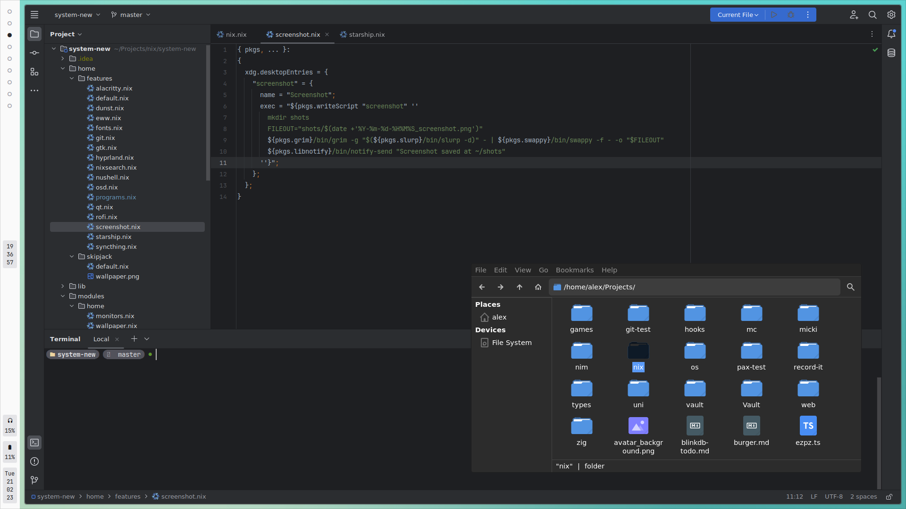

# *driverOS*

This repository contains the entirety of my operating system, all my used applications, my dotfiles and my custom app themes.

## Huh?

- [Nix](https://nixos.org/) is a package manager for Linux systems. It's purely functional: It treats packages as immutable, which brings a few advantages like having the ability to install multiple versions of packages at the same time, and atomic upgrades & rollbacks. All package definitions are written in a functional language called Nix.

- [NixOS](https://nixos.org/) is an operating system built entirely with Nix. The complete operating system is built from a declarative Nix config: With the advantage of all configuration being defined in a single place, distribution becomes easy. With NixOS, you also gain all the advantages of Nix: You can roll back faulty system configurations and test changes to your OS before you deploy them.

> You can read more about NixOS [here](https://nixos.org/features.html).

## Highlights

- Multiple **OS configurations**, for my **laptop** & **workstation**
- Fully **declarative** config for my daily drivers
  - hyprland / eww / rofi / dunst, alacritty / nushell / starship, intellij, gtk / qt, syncthing, greetd, wayland, zathura
- **User** & **Global** packages managed with the same config
- **Consistent** declarative config for wallpaper & color theme

## Installation

You can install this on any computer that runs NixOS [with flake support enabled](https://nixos.wiki/wiki/Flakes).
*(Obviously, some settings are OS- & hardware-specific, so it's probably better if you integrate relevant settings into your own config.)*

1. Clone the repository.
2. Run `sudo nixos-rebuild switch --flake '.#<hostname>'`
   - Optionally, link the `flake.nix` with `ln -s <repository-flake-path> /etc/nixos/flake.nix` so that future rebuilds use the repository automatically.
3. Done!

All application settings are managed declaratively, except for:

- IntelliJ IDEA which uses settings sync.
- Firefox which has account sync.
- Private SSH Keys, which can't be easily managed with a public git repo.